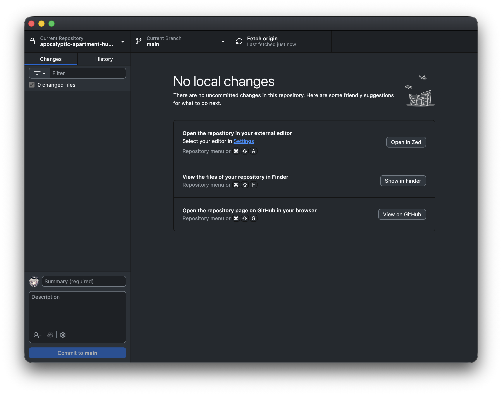
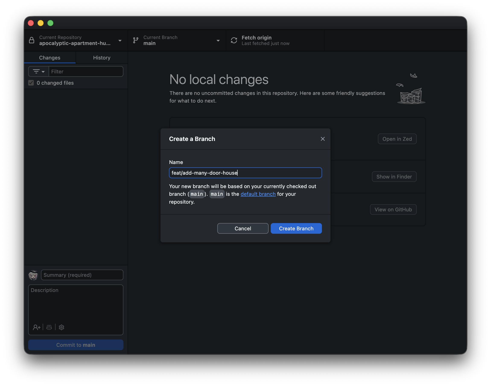
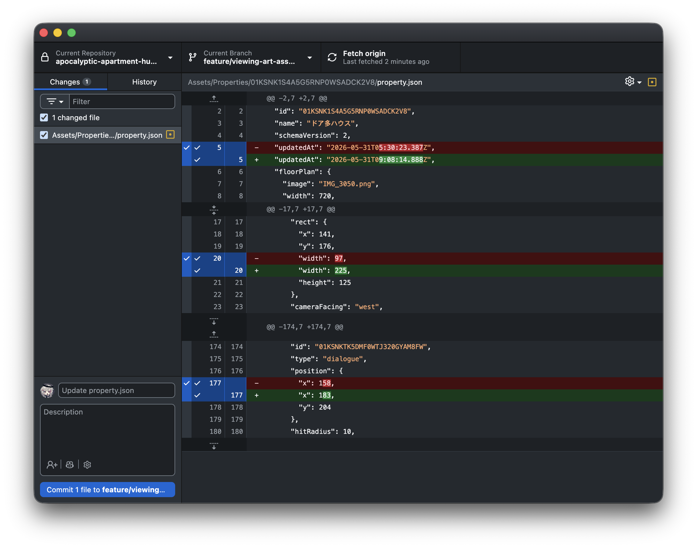
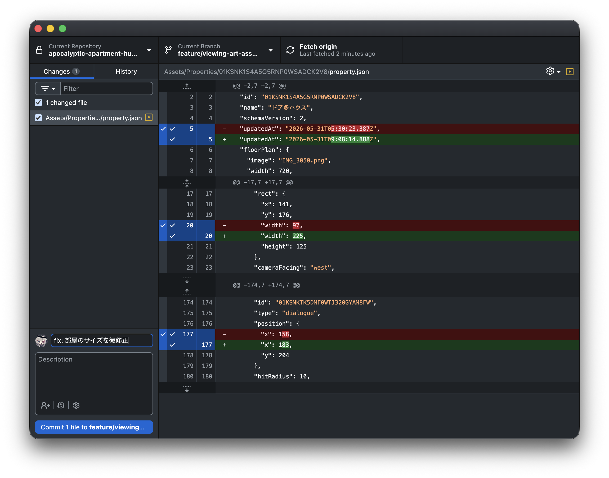
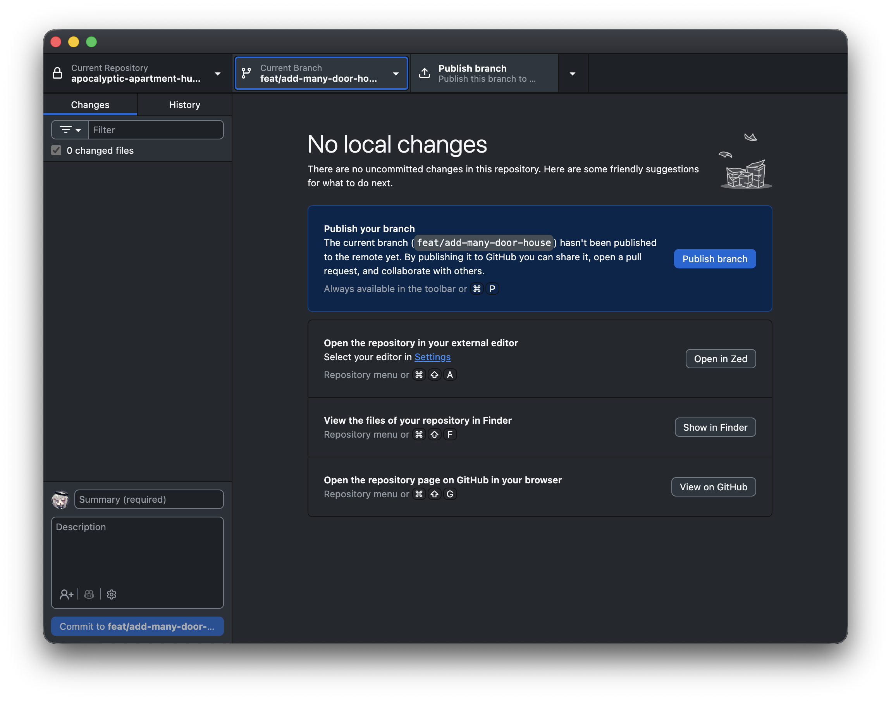
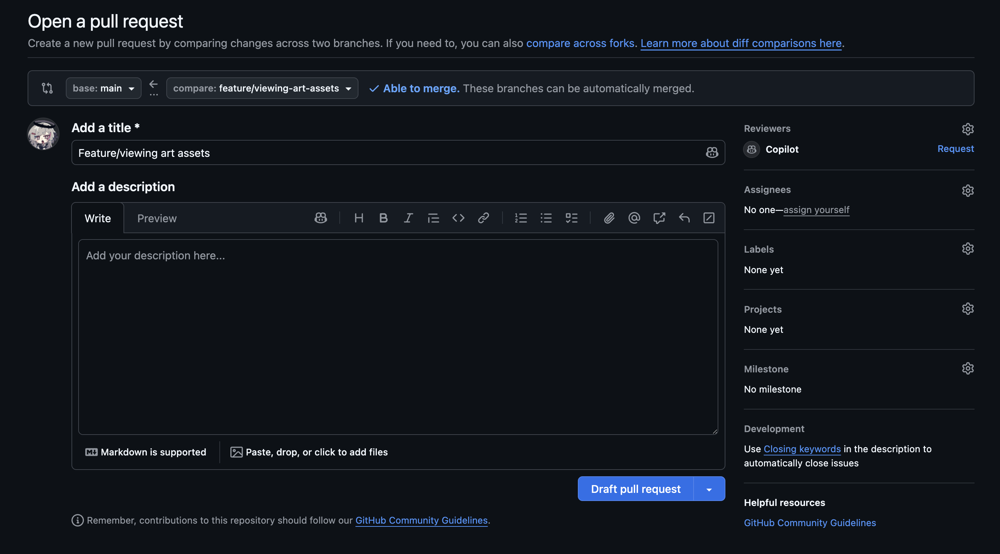

# 8. 共同開発のやり方（GitHub でシナリオを提出する）

チームでの制作では、書いたシナリオを **GitHub** という仕組みでチームに提出する。
このページは、シナリオライターが GitHub を使って安全に作業を提出するまでの手順。
**プログラミングと同じく、GitHub の知識も前提にしない。**

> 💡 ツールは **GitHub Desktop**（無料の公式アプリ）を前提に説明する。
> プロジェクトで別のツールが指定されている場合はそちらの指示に従うこと。
> 初回のインストールとログイン設定は、エンジニアに手伝ってもらうのが早い。

## まず用語を 4 つだけ

| 用語 | 意味 |
|---|---|
| **リポジトリ** | プロジェクトのファイル一式の置き場。手元のパソコンに複製（クローン）して作業する |
| **ブランチ** | 作業専用の安全な作業場。ここで編集すれば他の人の作業と混ざらない。`main`（メイン）は全員の共有ブランチ |
| **コミット** | 変更内容に「何をしたか」の名前を付けて記録するひと区切り |
| **PR（プルリクエスト）** | 「この変更を取り込んでください」というお願い。提出後、エンジニアが内容を確認してから本体に反映される |

## 全体の流れ

| STEP | やること | 使うもの |
|---|---|---|
| **STEP 1** | ブランチを作る（作業場を用意） | GitHub Desktop |
| **STEP 2** | シナリオを書く・直す | テキストエディタ |
| **STEP 3** | 確認する（検証メニュー + 再生） | Unity |
| **STEP 4** | コミット → push → PR を出す（提出） | GitHub Desktop |
| **STEP 5** | レビューのコメントに対応する | テキストエディタ + GitHub Desktop |

```
 STEP 1 ──→ STEP 2 ──→ STEP 3 ──→ STEP 4 ──→ STEP 5
ブランチ    シナリオ     確認       提出       レビュー
を作る      を書く     (Unity)     (PR)       対応
```

## はじめに押さえる 3 つの鉄則

1. **編集の前に、必ず STEP 1（ブランチを作る）から始める。** ブランチを作らずに編集すると、他の人の作業と混ざってしまう。
2. **`main` ブランチの上で直接編集しない。** `main` は全員の共有ブランチ。必ず自分のブランチを作ってから編集する。
3. **1 つの作業 = 1 つのブランチ = 1 つの PR。** 1 回の提出には 1 つのまとまった変更だけを入れる（例:「2 章のシナリオを追加」だけ。あれこれ詰め込まない）。

---

## 🟢 前半: 編集の前にやること（STEP 1）

### 1. 最新の状態にする

他の人の変更を取り込んで、最新の状態から作業を始める。

1. GitHub Desktop を開く。
2. 画面上中央の **`Current Branch`** が **`main`** になっていることを確認する
   （なっていなければクリックして `main` を選ぶ）。
3. 上部の **`Fetch origin`** ボタンを押す。表示が **`Pull origin`** に変わったら、それも押して最新を取り込む。



### 2. 新しいブランチを作る

1. 上中央の **`Current Branch`** をクリック → **`New Branch`** を押す。
2. ブランチ名を入力する。**内容が分かる英語の名前**を付ける。

形式の目安: **`feat/内容を表す英単語`**（小文字、単語の区切りは `-`）

| 作業内容 | ブランチ名の例 |
|---|---|
| 新しいシナリオを追加 | `feat/scenario-chapter2` |
| 台詞の修正 | `fix/typo-chapter1` |

> 💡 プロジェクトでブランチ名の付け方が決まっている場合はそちらに従う。

3. **`Create Branch`** を押す。これで自分専用の作業場ができた。



> ここまで済んだら、テキストエディタに移ってシナリオを書く（[1 章](./01-basics.md)〜[7 章](./07-pitfalls.md)）。
> 書き終わったら、下の「後半」に戻ってくる。

---

## 提出前の確認（STEP 3）

提出する前に、最低限この 2 つを流す。

1. **Novel > Validate Scenarios**（Unity のメニュー）— 文法エラーと、存在しない名前
   （キャラ・画像・音・構図）を使っている行を一括チェックできる（[1 章](./01-basics.md)参照）。
2. **実際に再生して通しで確認** — 誤字・演出の抜けは再生しないと分からない。

---

## 🔵 後半: 編集が終わったら（STEP 4）

ここからは、ファイルの保存が **済んでいる** 前提。

### 3. 変更内容を確認する

1. GitHub Desktop に戻る。
2. 左側の **`Changes`** タブに、変更したファイルの一覧が出ている（書いた `.rb` など）。
3. ファイルをクリックすると、右側で「どこが変わったか」を確認できる（赤 = 削除した行、緑 = 追加した行）。



> ⚠️ **身に覚えのないファイルがたくさん出ているとき**は、いったん提出せずエンジニアに確認する
> （Unity が自動生成したファイルが混ざることがある）。提出するのは自分が編集したファイルだけにする。

### 4. コミットする（変更に名前を付けて記録）

1. 左下の入力欄（**`Summary`**）に、何をしたかを日本語で短く書く
   （例: `2章の教室シーンを追加`、`1章の誤字を修正`）。書き方の細かい決まりはない。
   後から見て何の変更か分かれば十分。
2. 必要なら下の `Description` 欄に補足を書く（空でもよい）。
3. 左下の **`Commit to <ブランチ名>`** ボタンを押す。



### 5. push する（自分の変更を GitHub に送る）

コミットしただけでは、変更はまだ自分のパソコンの中だけにある。

1. 上部に出る **`Push origin`** ボタンを押す。
2. そのブランチを初めて送るときは **`Publish branch`** という表示になる。同じく押せばよい。



### 6. PR（プルリクエスト）を作る

1. push が終わると、GitHub Desktop に **`Preview Pull Request`** / **`Create Pull Request`** の
   ボタンが出る。押すとブラウザが開いて GitHub の PR 作成画面に移動する。
2. ブラウザの画面で:
   - **タイトル**: コミットメッセージと同じでよい（例: `2章の教室シーンを追加`）。
   - **説明（Description）**: 何をしたか・確認してほしい点を書く。下のテンプレを参考に。
3. 緑の **`Create pull request`** ボタンを押す。これで提出完了 🎉



説明欄のテンプレ（コピーして使う）:

```
## やったこと
- （例）2章の教室シーン（classroom_2a）のシナリオを新規追加

## 確認してほしいこと
- （例）選択肢後の分岐でフラグの使い方が合っているか
- （例）立ち絵キーの指定が正しいか

## メモ
- （あれば。なければ削除）
```

---

## 提出した後（STEP 5）

- PR を出すと、エンジニア（または担当者）が内容を確認（レビュー）する。
- 「ここ直して」とコメントが付いたら:
  1. **同じブランチのまま** テキストエディタで直す
  2. もう一度 **保存 → コミット → `Push origin`**
  3. PR は自動で更新される（**PR を作り直す必要はない**）
- 問題がなければマージ（本体に反映）されて完了。
- **次に別の作業を始めるときは、また STEP 1 から**（`main` に戻る → 最新を取り込む →
  新しいブランチを作る）。前のブランチのまま次の作業を続けないこと。

---

## 困ったとき

| 症状 | 対処 |
|---|---|
| 間違って `main` で編集してしまった | まだコミットしていなければ慌てなくてよい。そのままエンジニアに「main で編集してしまった」と相談（ブランチへ移す操作をしてもらえる） |
| `Push` でエラーが出る | 他の人の変更と衝突している可能性。自己判断で進めず、エラー表示のスクリーンショットを添えてエンジニアに相談 |
| `Changes` に大量の知らないファイルが出る | Unity の自動生成の可能性。提出前にエンジニアに確認 |
| PR の作り方の画面を閉じてしまった | GitHub Desktop のメニュー `Branch` → `Create Pull Request` からいつでも開ける |
| どのブランチで作業していたか分からなくなった | `Current Branch` の表示を見る。分からなければ触らずエンジニアに相談 |

---

戻る: [目次](./index.md)
